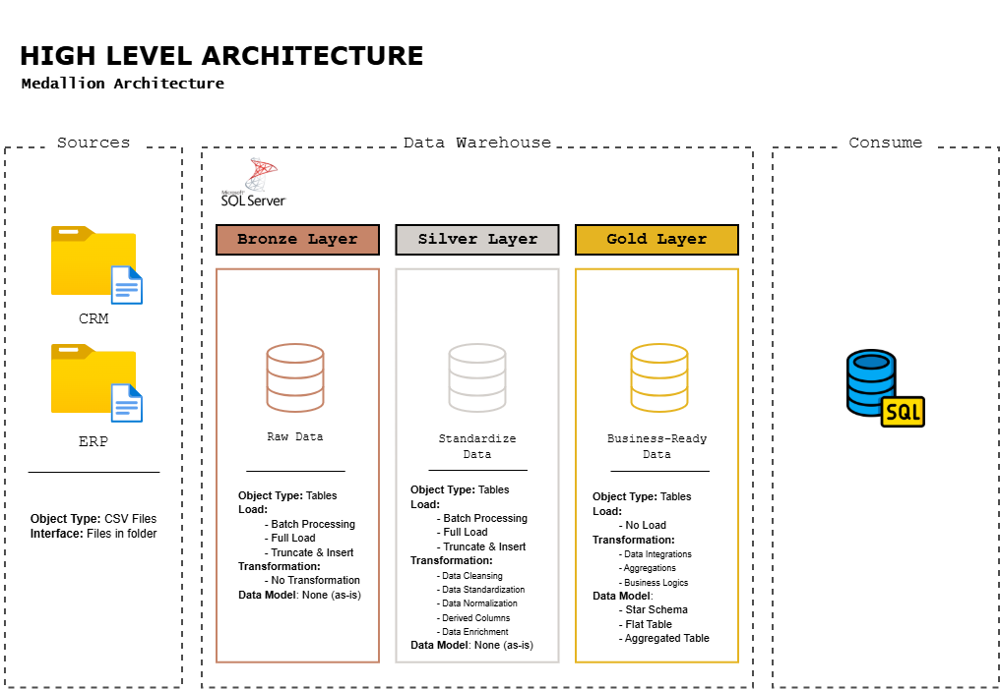

# :pushpin: Data Warehouse
This project demonstrates the development of a data warehouse that manages data so it can be analyzed and transformed into valuable insights. The data warehouse in this project is built using SQL Server and implements the Medallion Architecture as the structural foundation for the data warehouse.

# 🧱 Data Architecture

This data architecture adopts the Medallion Architecture, which is divided into three layers: Bronze, Silver, and Gold.
1. Bronze  : Stores raw data ingested directly from local sources without any modifications or transformations
2. Silver  : Performs data cleaning and standardization on all data from the Bronze layer, preparing it for use in the Gold layer.
3. Gold    : Prepares the data required for business analysis by extracting it from the Silver layer.

